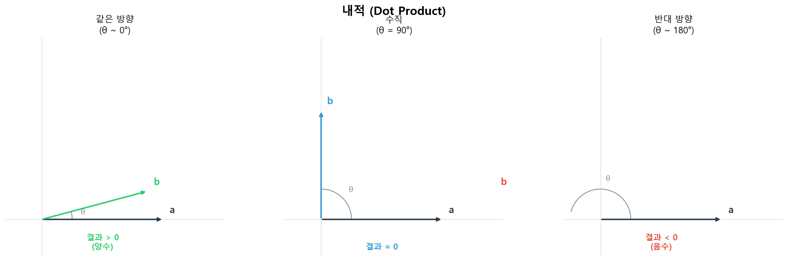
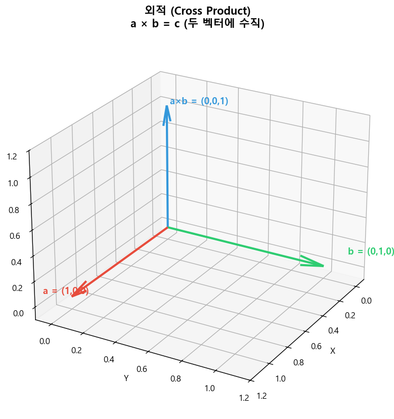
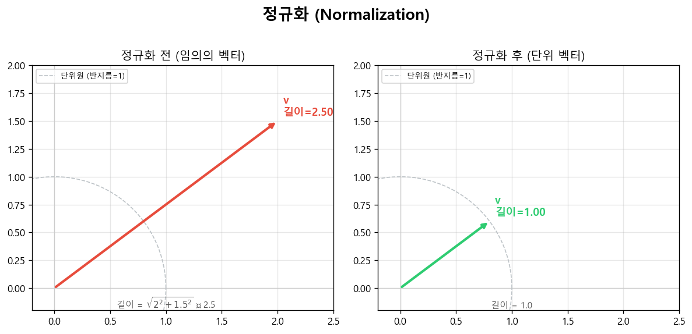

# Phase 1 학습 노트 — CPU 레이트레이서

## Ch.1 — 이미지 출력 (Output an Image)

### 핵심 개념

**PPM 포맷**
외부 라이브러리 없이 이미지를 저장하는 가장 단순한 포맷. 픽셀 데이터를 텍스트로 저장한다.
```
P3         ← RGB 텍스트 형식
256 256    ← 가로 세로 해상도
255        ← 채널 최댓값
0 0 0      ← 첫 번째 픽셀 (R G B)
1 0 0      ← 두 번째 픽셀
...
```

**이미지 좌표계**
- 픽셀 `(i, j)` 에서 `i`는 열(x), `j`는 행(y)
- PPM은 위쪽 행(`j=0`)부터 저장 → 화면 좌표와 y축이 반대
- 레이트레이서에서 광선을 쏠 때 이 좌표계를 그대로 사용

**색상의 정규화 (0.0~1.0)**
- PBR의 모든 계산은 0~255 정수가 아닌 0.0~1.0 실수로 이루어진다
- 빛의 세기, 반사율, 투과율 모두 이 범위 안에서 계산
- 최종 출력 직전에만 255를 곱해 정수로 변환 (추후 Gamma correction도 여기서 적용)

### 결과물
좌표값을 색상으로 직접 출력한 그라디언트 이미지:
- 왼쪽 아래: 검정 (0, 0, 0)
- 오른쪽 아래: 빨강 (255, 0, 0)
- 왼쪽 위: 초록 (0, 255, 0)
- 오른쪽 위: 노랑 (255, 255, 0)

### 관련 파일
- [src/main.cpp](pbr-raytracer/src/main.cpp)

---

## Ch.2 — vec3 클래스 (The vec3 Class)

### 핵심 개념

**vec3의 세 가지 용도**
레이트레이서에서 vec3 하나로 세 가지를 표현한다:

| 별칭 | 용도 | 예시 |
|------|------|------|
| `vec3` | 방향, 이동량 | 광선 방향, 법선 벡터 |
| `point3` | 공간상의 위치 | 광선 출발점, 교차점 |
| `color` | RGB 색상 | 픽셀 색상, 빛의 세기 |

세 가지 모두 같은 타입이다. `using` 별칭으로 코드의 의도를 명확하게 표현한다.

**내적 (dot product)**

$$\vec{a} \cdot \vec{b} = a_x b_x + a_y b_y + a_z b_z = |\vec{a}||\vec{b}|\cos\theta$$



- 두 벡터가 얼마나 같은 방향인지를 수치로 표현
- 같은 방향 → 양수 / 수직 → 0 / 반대 방향 → 음수
- 두 벡터가 모두 단위 벡터일 때 결과는 $\cos\theta$ 와 같다 (-1 ~ 1 범위)
- PBR에서 가장 많이 쓰이는 연산: `NdotL` (법선·광원), `NdotV` (법선·시선), `HdotL` (하프벡터·광원)

```cpp
double dot(vec3 a, vec3 b)  // 결과: 스칼라
```

---

**외적 (cross product)**

$$\vec{a} \times \vec{b} = \begin{pmatrix} a_y b_z - a_z b_y \\ a_z b_x - a_x b_z \\ a_x b_y - a_y b_x \end{pmatrix}$$



- 두 벡터에 동시에 수직인 벡터를 반환 (결과의 방향은 오른손 법칙을 따름)
- 카메라 좌표계의 right/up 벡터 계산, 삼각형 법선 벡터 계산에 사용
- 교환법칙이 성립하지 않는다: $\vec{a} \times \vec{b} = -(\vec{b} \times \vec{a})$

```cpp
vec3 cross(vec3 a, vec3 b)  // 결과: 벡터
```

---

**정규화 (unit_vector)**

$$\hat{v} = \frac{\vec{v}}{|\vec{v}|} = \frac{\vec{v}}{\sqrt{v_x^2 + v_y^2 + v_z^2}}$$



- 방향은 유지하고 길이를 1로 맞추는 연산
- 광선 방향 벡터, 법선 벡터는 반드시 단위 벡터여야 한다
- 내적 결과가 $-1 \sim 1$ 범위에 들어오려면 두 벡터 모두 정규화되어 있어야 함

```cpp
vec3 unit_vector(vec3 v)  // 길이를 1로 맞춤
```

---

**length_squared() 를 따로 두는 이유**

$$|\vec{v}|^2 = v_x^2 + v_y^2 + v_z^2$$

`sqrt()`는 연산 비용이 크다. 두 길이를 비교할 때는 제곱값끼리 비교하면 `sqrt()` 없이도 된다.

$$|\vec{a}| < |\vec{b}| \iff |\vec{a}|^2 < |\vec{b}|^2$$

### 관련 파일
- [src/vec3.h](pbr-raytracer/src/vec3.h)
