# Phase 1 학습 노트 — CPU 레이트레이서

> 이 노트는 [Ray Tracing in One Weekend](https://raytracing.github.io/) 를 따라가며 배운 내용을 정리한 것입니다.
> 수식보다 **"이게 왜 필요한가"** 와 **"실제로 무슨 의미인가"** 에 집중합니다.

---

## Ch.1 — 이미지 출력 (Output an Image)

### 왜 이걸 먼저 하는가?

레이트레이서를 만들기 전에, **"렌더링 결과를 파일로 저장하는 파이프라인"** 이 정상인지 먼저 확인해야 한다.
아무리 렌더링 코드가 잘 돌아도 결과를 볼 수 없으면 의미가 없다.

---

### PPM 포맷 — 가장 단순한 이미지 저장 방식

PNG, JPG 같은 포맷은 압축/인코딩 라이브러리가 필요하다.
PPM은 그냥 **메모장에 숫자를 적는 것**과 같다. 라이브러리가 전혀 필요 없다.

```
P3           ← "이 파일은 RGB 숫자들입니다" 라는 선언
256 256      ← 가로 256픽셀, 세로 256픽셀
255          ← R, G, B 각각의 최댓값
255 0 0      ← 첫 번째 픽셀: 빨강
0 255 0      ← 두 번째 픽셀: 초록
0 0 255      ← 세 번째 픽셀: 파랑
...
```

#### 왜 255.999를 곱하나? (255.0이 아니라)

```cpp
int ir = int(255.999 * pixel_color.x());
```

부동소수점(소수) 계산에서 정확히 1.0이 나와야 할 값이 0.9999999...로 나오는 경우가 있다.
이 상태에서 `× 255.0` 을 하면 254.9999...가 되고, `int()` 로 자르면 **254** 가 된다.
255.999를 곱하면 0.9999... × 255.999 = 255.998...이 되어 `int()` 결과가 **255** 로 올바르게 나온다.

---

### 색상을 0~255가 아닌 0.0~1.0으로 쓰는 이유

PBR의 모든 빛 계산은 **0.0~1.0 실수**로 이루어진다.

> 예: 반사율 0.8 = "빛의 80%를 반사"
> 예: 투과율 0.3 = "빛의 30%가 통과"

0~255 정수는 모니터 출력 직전에만 필요하다.
중간 계산을 0~255로 하면 정밀도가 떨어지고 곱셈/나눗셈도 불편해진다.

```
계산 중:  0.0 ~ 1.0  (실수)
화면 출력: 0 ~ 255    (정수) ← 맨 마지막에 × 255.999 후 int()로 변환
```

---

### 이미지 좌표계 — y축이 아래를 향한다

수학에서 y축은 위를 향하지만, 이미지(화면)에서는 **y축이 아래를 향한다.**
왼쪽 위가 (0, 0)이고, 오른쪽 아래가 (width-1, height-1)이다.

```
(0,0) ──────────────→ x (i)
  │  ████████████████
  │  ████████████████
  ↓  ████████████████
  y(j)
```

왜 y가 아래 방향인가? → 컴퓨터 메모리는 위 행부터 순서대로 저장한다.
첫 번째 저장되는 픽셀이 (0, 0)이고, 다음 행은 (0, 1)... 이렇게 내려가기 때문.

PPM도 이 순서를 따라 위쪽 행(j=0)부터 픽셀을 저장한다.

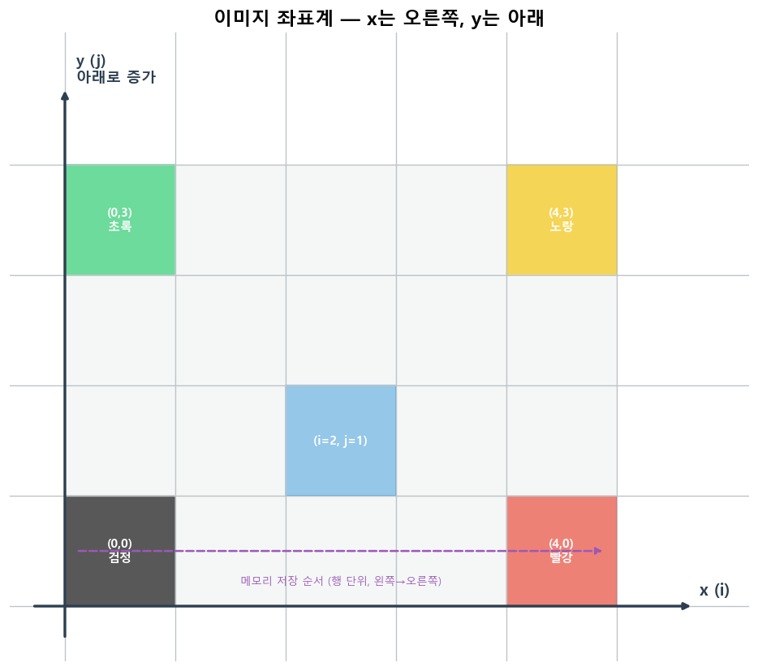

---

### 결과물 — 좌표를 색상으로

테스트 이미지는 픽셀 위치 `(i, j)` 를 그대로 색상으로 변환해 출력한다:

```cpp
double r = double(i) / (image_width  - 1);  // 가로 위치 → R값 (0.0~1.0)
double g = double(j) / (image_height - 1);  // 세로 위치 → G값 (0.0~1.0)
double b = 0.0;                              // 파랑은 항상 0
```

이 수식이 맞는지 모서리로 확인:

| 모서리 | i, j | R, G 계산 | 결과 색상 |
|--------|------|----------|----------|
| 왼쪽 위 | i=0, j=0 | R=0/max=0, G=0/max=0 | 검정 |
| 오른쪽 위 | i=max, j=0 | R=1.0, G=0 | 빨강 |
| 왼쪽 아래 | i=0, j=max | R=0, G=1.0 | 초록 |
| 오른쪽 아래 | i=max, j=max | R=1.0, G=1.0 | 노랑 |

### 관련 파일
- [src/main.cpp](pbr-raytracer/src/main.cpp)

---

## Ch.2 — vec3 클래스 (The vec3 Class)

### 왜 이걸 만드는가?

레이트레이서에서 다루는 모든 것은 3D 공간 위에 있다:
- 광선의 출발 **위치**
- 광선이 날아가는 **방향**
- 픽셀의 **색상**

이 세 가지를 모두 숫자 3개 묶음 `(x, y, z)` 으로 표현할 수 있다.
vec3은 그 숫자 3개를 묶고 + - × 같은 연산을 편하게 쓰기 위한 클래스다.

---

### vec3의 세 가지 얼굴

같은 `vec3` 타입을 용도에 따라 다르게 부른다:

| 이름 | 뜻 | 예시 |
|------|-----|------|
| `vec3` | 방향 또는 이동량 | "북동쪽으로 2미터" |
| `point3` | 공간상의 위치 | "위도 37°, 경도 127°" |
| `color` | 빛의 색상/세기 | R=0.8, G=0.3, B=0.1 |

코드는 완전히 동일하지만 이름을 달리해서 **"이 변수가 위치인지 방향인지 색상인지"** 를 명확하게 한다.

---

### 내적 (Dot Product) — "두 방향이 얼마나 일치하는가"

$$\vec{a} \cdot \vec{b} = a_x b_x + a_y b_y + a_z b_z$$

이것이 왜 "방향의 일치도"를 나타내는지 직접 숫자로 확인해보자.

**예시 1 — 완전히 같은 방향:**
오른쪽을 향하는 벡터 두 개: $\vec{a} = (1, 0, 0)$, $\vec{b} = (1, 0, 0)$

$$\vec{a} \cdot \vec{b} = 1 \times 1 + 0 \times 0 + 0 \times 0 = 1$$

→ 결과가 **1** (가장 큰 양수) ← 완전히 일치함

**예시 2 — 완전히 수직인 방향:**
오른쪽 $\vec{a} = (1, 0, 0)$, 위쪽 $\vec{b} = (0, 1, 0)$

$$\vec{a} \cdot \vec{b} = 1 \times 0 + 0 \times 1 + 0 \times 0 = 0$$

→ 결과가 **0** ← 전혀 관계없는 방향

**예시 3 — 완전히 반대 방향:**
오른쪽 $\vec{a} = (1, 0, 0)$, 왼쪽 $\vec{b} = (-1, 0, 0)$

$$\vec{a} \cdot \vec{b} = 1 \times (-1) + 0 \times 0 + 0 \times 0 = -1$$

→ 결과가 **-1** (가장 작은 음수) ← 완전히 반대임

이걸 수식으로 정리하면:

$$\vec{a} \cdot \vec{b} = |\vec{a}||\vec{b}|\cos\theta$$

| 각도 θ | cos θ | 내적 결과 (단위벡터 기준) | 의미 |
|--------|--------|--------------------------|------|
| 0° | 1.0 | 1.0 | 완전히 같은 방향 |
| 90° | 0.0 | 0.0 | 수직 |
| 180° | -1.0 | -1.0 | 완전히 반대 방향 |

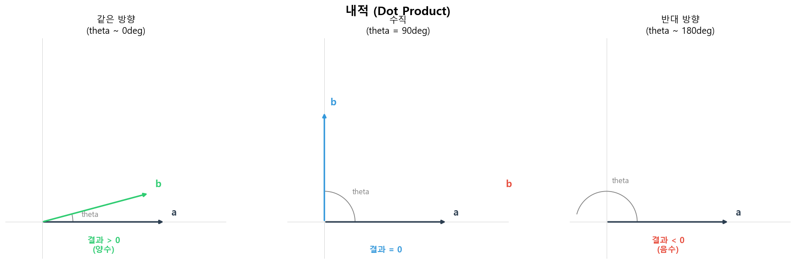

**직관적 비유:**
손전등을 벽에 비출 때, 손전등이 벽과 수직일수록 밝게 빛난다.
내적은 바로 이것을 수치로 표현한다. `NdotL` (법선 · 광원 방향) = 표면이 빛을 향할수록 밝아지는 PBR의 기본 원리.

```cpp
double dot(vec3 a, vec3 b)  // 결과: 숫자(스칼라)
```

---

### 외적 (Cross Product) — "두 벡터에 동시에 수직인 방향 찾기"

$$\vec{a} \times \vec{b} = \begin{pmatrix} a_y b_z - a_z b_y \\ a_z b_x - a_x b_z \\ a_x b_y - a_y b_x \end{pmatrix}$$

수식이 복잡해 보이지만, **결과가 무엇인가** 에 집중하면 된다.
결과는 항상 입력 두 벡터와 **동시에 수직**인 벡터다.

**예시 — 오른쪽 × 위쪽 = ?**
$\vec{a} = (1, 0, 0)$ (오른쪽), $\vec{b} = (0, 1, 0)$ (위쪽)

$$\vec{a} \times \vec{b} = \begin{pmatrix} 0 \times 0 - 0 \times 1 \\ 0 \times 0 - 1 \times 0 \\ 1 \times 1 - 0 \times 0 \end{pmatrix} = \begin{pmatrix} 0 \\ 0 \\ 1 \end{pmatrix}$$

결과가 $(0, 0, 1)$ = 앞쪽 방향이다. 오른쪽과 위쪽에 동시에 수직인 방향은 앞쪽뿐!

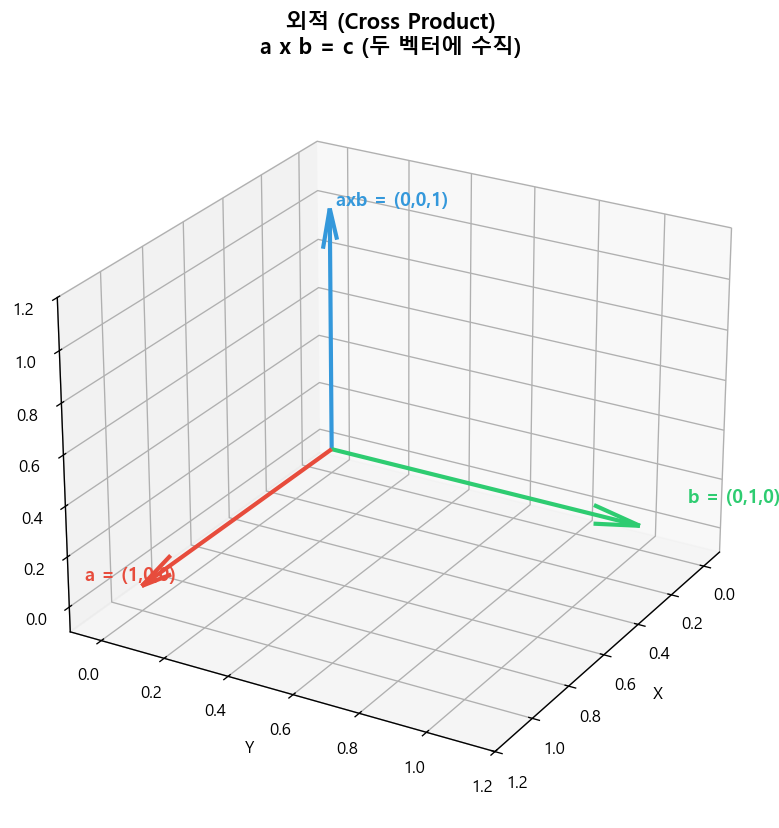

**오른손 법칙:** 오른손 검지를 a 방향, 중지를 b 방향으로 펼치면
엄지가 가리키는 방향이 a × b다.

> 주의: 순서가 바뀌면 방향이 반대가 된다.
> $\vec{a} \times \vec{b} = -(\vec{b} \times \vec{a})$

**PBR에서 어디에 쓰이나?**
- 카메라 좌표계 구성: 앞 방향과 위 방향으로 오른쪽 방향을 계산
- 삼각형 법선 계산: 삼각형의 두 변 벡터로 면의 수직 방향을 계산

```cpp
vec3 cross(vec3 a, vec3 b)  // 결과: 벡터
```

---

### 정규화 (Normalization) — "방향만 남기고 크기는 버리기"

$$\hat{v} = \frac{\vec{v}}{|\vec{v}|} = \frac{\vec{v}}{\sqrt{v_x^2 + v_y^2 + v_z^2}}$$

#### 벡터의 "길이"는 어떻게 계산하나?

3D 공간에서 길이는 피타고라스 정리를 두 번 적용해 구한다:

```
1단계: x-z 평면의 대각선 = √(x² + z²)
2단계: 대각선과 y로 최종 거리 = √((√(x²+z²))² + y²) = √(x² + y² + z²)
```

$$|\vec{v}| = \sqrt{v_x^2 + v_y^2 + v_z^2}$$

**예시 — (3, 4, 0) 벡터의 길이:**

$$|(3, 4, 0)| = \sqrt{3^2 + 4^2 + 0^2} = \sqrt{9 + 16} = \sqrt{25} = 5$$

#### 정규화 예시

$(3, 4, 0)$ 을 길이 5로 나누면:

$$\hat{v} = \frac{(3, 4, 0)}{5} = (0.6, 0.8, 0)$$

확인: $\sqrt{0.6^2 + 0.8^2} = \sqrt{0.36 + 0.64} = \sqrt{1.0} = 1.0$ ✓

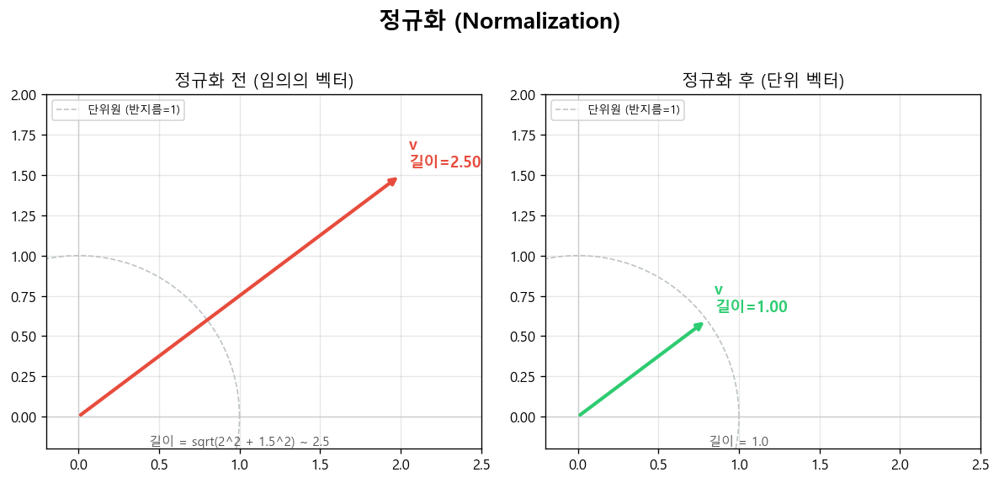

**직관:** "북쪽으로 100km" 와 "북쪽으로 1km" 는 방향은 같지만 거리가 다르다.
정규화는 거리를 버리고 **"방향만"** 남기는 것이다. 결과 벡터의 길이는 항상 1.

**왜 길이를 1로 맞춰야 하나?**
내적 결과 = $|\vec{a}||\vec{b}|\cos\theta$ 에서, 두 벡터의 길이가 모두 1이면:

$$1 \times 1 \times \cos\theta = \cos\theta$$

길이가 1이 아니면 내적 결과에 길이가 섞여 들어와 cos θ 값 자체를 얻을 수 없다.

```cpp
vec3 unit_vector(vec3 v)  // 길이를 1로 맞춘 벡터 반환
```

---

### 왜 `length_squared()`를 따로 만드는가?

$$|\vec{v}|^2 = v_x^2 + v_y^2 + v_z^2$$

`sqrt()` (제곱근)는 CPU에서 꽤 비싼 연산이다.
두 벡터의 길이를 **비교하는 것**이 목적이라면 제곱근 없이도 된다:

$$|\vec{a}| < |\vec{b}| \iff |\vec{a}|^2 < |\vec{b}|^2$$

예시: 3 < 5 가 맞는지 확인할 때
- 제곱근 쓰면: √9 < √25 → 3 < 5 ✓ (제곱근 2번)
- 제곱만 쓰면: 9 < 25 ✓ (제곱근 0번, 결과 동일)

1000번 비교한다면 `sqrt()` 1000번을 절약할 수 있다.

### 관련 파일
- [src/vec3.h](pbr-raytracer/src/vec3.h)

---

## Ch.3 — 광선, 카메라, 배경 (Rays, a Simple Camera, and Background)

### 레이트레이서의 핵심 아이디어

현실에서 빛은 광원 → 물체 → 눈 순서로 온다.
레이트레이서는 이걸 **거꾸로** 한다: 눈(카메라) → 픽셀 → 물체 방향으로 광선을 쏜다.

왜 거꾸로 하는가? → 눈에 도달하는 빛만 계산하면 되기 때문.
광원에서 출발한 빛 대부분은 눈에 도달하지 않아 낭비다.

```
현실:        광원 → 물체 → 눈 (대부분 낭비)
레이트레이서: 눈  → 픽셀 → 물체 → 광원 (필요한 것만 계산)
```

---

### 광선 방정식 — "출발점 + 방향 × 거리"

$$P(t) = \mathbf{A} + t \cdot \mathbf{b}$$

- $\mathbf{A}$: 광선 출발점 (카메라 위치)
- $\mathbf{b}$: 광선 방향
- $t$: 얼마나 멀리 갔는지 (거리 비례)

**구체적 예시** — 카메라가 원점 $(0, 0, 0)$, 정면(z 음의 방향)을 바라볼 때:

| t 값 | 계산 | 결과 위치 | 의미 |
|------|------|----------|------|
| 0 | $(0,0,0) + 0 \times (0,0,-1)$ | $(0,0,0)$ | 카메라 위치 그 자체 |
| 1 | $(0,0,0) + 1 \times (0,0,-1)$ | $(0,0,-1)$ | 1 유닛 앞 |
| 5 | $(0,0,0) + 5 \times (0,0,-1)$ | $(0,0,-5)$ | 5 유닛 앞 |
| -1 | $(0,0,0) + (-1) \times (0,0,-1)$ | $(0,0,+1)$ | 카메라 뒤쪽 (무시) |

t를 조절하면 광선 위의 어느 점이든 구할 수 있다.

```cpp
point3 at(double t) const { return orig + t * dir; }
```

---

### 뷰포트 — "카메라 앞에 놓인 가상의 스크린"

카메라와 씬 사이에 가상의 직사각형을 하나 놓는다.
각 픽셀마다 카메라에서 해당 픽셀 위치를 향해 광선을 하나 쏜다.

```
      카메라
        ●
        │ ← focal_length (카메라~스크린 거리)
  ┌─────┼─────┐
  │  [0,0]    │  ← 뷰포트 (가상 스크린)
  │           │
  └───────────┘
        ↓ 광선들이 이 스크린을 통과해 씬으로 날아감
```

#### 픽셀 하나의 크기 계산

뷰포트 전체 크기를 픽셀 수로 나누면 픽셀 하나의 크기가 나온다:

```cpp
vec3 pixel_delta_u = viewport_u / image_width;   // 가로 픽셀 하나의 폭
vec3 pixel_delta_v = viewport_v / image_height;  // 세로 픽셀 하나의 높이
```

예시: 뷰포트 너비 = 3.55, 이미지 너비 = 400 → 픽셀 하나 = 0.00889 유닛

#### 각 픽셀 중심의 위치 계산

픽셀 (i, j) 의 중심 위치:

```cpp
point3 pixel_center = pixel00_loc         // 첫 번째 픽셀(0,0)의 중심
                    + (i * pixel_delta_u) // i번째 픽셀만큼 오른쪽으로
                    + (j * pixel_delta_v); // j번째 픽셀만큼 아래쪽으로
```

- 뷰포트가 클수록 시야각(FOV)이 넓어진다
- `focal_length`가 클수록 시야각이 좁아진다 (망원렌즈 효과)

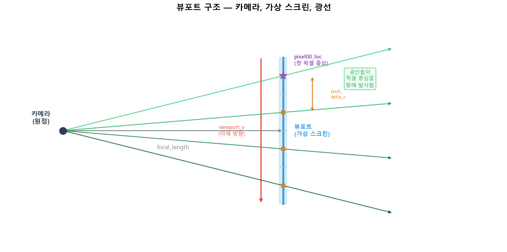

---

### 선형 보간 (Lerp) — "두 색 사이를 부드럽게 섞기"

$$\text{color}(t) = (1-t) \cdot \text{흰색} + t \cdot \text{하늘색}$$

#### y 방향을 0~1 범위로 변환하는 과정

광선 방향을 정규화하면 y 성분은 반드시 **-1 ~ +1** 범위가 된다.
(길이가 1인 벡터의 각 성분은 -1~+1을 벗어날 수 없다)

- 광선이 위를 향하면 y = +1.0
- 광선이 수평을 향하면 y = 0.0
- 광선이 아래를 향하면 y = -1.0

Lerp는 0~1 범위를 입력으로 받으므로 변환이 필요하다:

$$t = \frac{y + 1}{2} = 0.5 \times (y + 1)$$

| y 값 | t = (y+1)/2 | 결과 색상 |
|------|------------|----------|
| -1.0 (아래) | 0.0 | 완전히 흰색 |
| 0.0 (수평) | 0.5 | 흰색+하늘색 중간 |
| +1.0 (위) | 1.0 | 완전히 하늘색 |

```cpp
double t = 0.5 * (unit_dir.y() + 1.0);      // y: -1~+1 → t: 0~1
return (1.0 - t) * white + t * sky_blue;    // Lerp
```

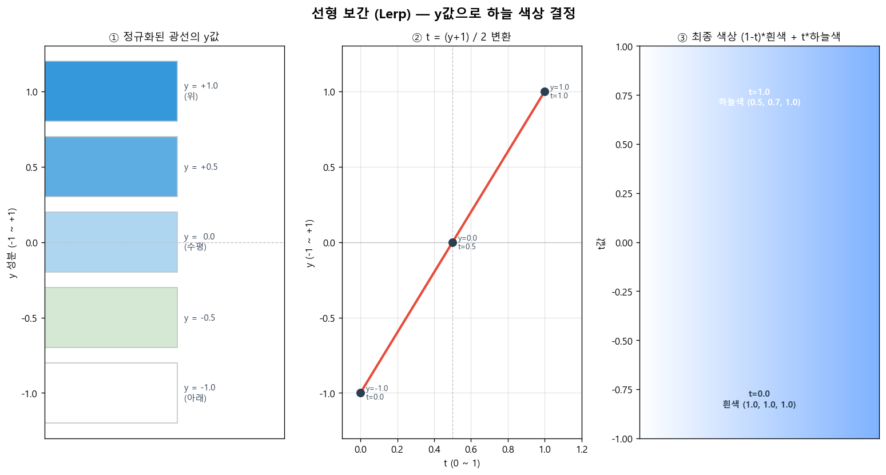

### 결과물


이후 챕터에서 이 배경 위로 구, 재질, 조명이 쌓여간다.

### 관련 파일
- [src/ray.h](pbr-raytracer/src/ray.h)
- [src/main.cpp](pbr-raytracer/src/main.cpp)

---

## Ch.4 — 구 추가 (Adding a Sphere)

### 왜 구부터 시작하는가?

3D 물체 중 **수학이 가장 단순한 것이 구**다.
삼각형, 박스, 메시 등은 훨씬 복잡하다.
레이트레이서의 교차 계산 원리를 가장 쉽게 배울 수 있는 출발점.

---

### 광선-구 교차 — "광선이 구에 맞는지 판별하기"

**직관적 이해:**
풍선(구)에 화살(광선)을 쏜다고 상상해보자.
- 화살이 풍선을 **통과**하면 두 번 맞는다 (들어가는 점, 나오는 점)
- 화살이 풍선에 **접선**으로 스치면 한 번 맞는다
- 화살이 풍선을 **빗나가면** 맞지 않는다

이걸 수학으로 표현해보자. **"광선 위의 어느 t에서 구 표면에 닿는가?"** 를 구하는 것이 목표다.

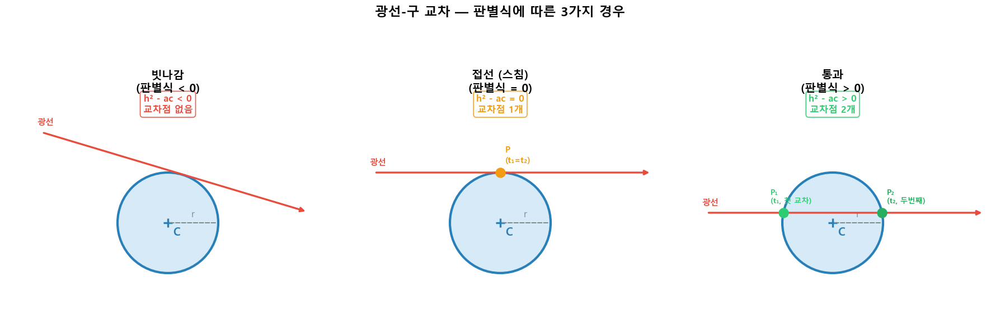

---

**① 구의 방정식 — 구가 뭔가**

구 = 중심 $\mathbf{C}$ 로부터 거리가 정확히 $r$ 인 점들의 집합.

$$|\mathbf{P} - \mathbf{C}|^2 = r^2$$

왜 거리를 제곱하나? → 제곱근 없이 계산할 수 있어서 더 빠르다.
$|\mathbf{P} - \mathbf{C}|^2 = (\mathbf{P} - \mathbf{C}) \cdot (\mathbf{P} - \mathbf{C})$ 이므로, 내적 계산만으로 된다.

---

**② 광선 방정식을 구 방정식에 대입**

광선 위의 점은 $\mathbf{P}(t) = \mathbf{A} + t\mathbf{b}$ 이다. ($\mathbf{A}$ = 카메라, $\mathbf{b}$ = 방향)

이 점이 구 위에 있다는 조건:

$$|\mathbf{A} + t\mathbf{b} - \mathbf{C}|^2 = r^2$$

여기서 $\mathbf{oc} = \mathbf{A} - \mathbf{C}$ (카메라에서 구 중심까지의 벡터) 로 치환하면:

$$|t\mathbf{b} + \mathbf{oc}|^2 = r^2$$

---

**③ 전개 — 벡터 내적으로 풀기**

$|\mathbf{u}|^2 = \mathbf{u} \cdot \mathbf{u}$ 이므로:

$$(t\mathbf{b} + \mathbf{oc}) \cdot (t\mathbf{b} + \mathbf{oc}) = r^2$$

내적은 일반 곱셈처럼 분배법칙이 성립한다:

$$(t\mathbf{b}) \cdot (t\mathbf{b}) + (t\mathbf{b}) \cdot \mathbf{oc} + \mathbf{oc} \cdot (t\mathbf{b}) + \mathbf{oc} \cdot \mathbf{oc} = r^2$$

각 항을 정리하면:

| 항 | 정리 결과 | 이유 |
|----|----------|------|
| $(t\mathbf{b}) \cdot (t\mathbf{b})$ | $t^2(\mathbf{b} \cdot \mathbf{b})$ | 스칼라 $t^2$ 은 밖으로 꺼낼 수 있다 |
| $(t\mathbf{b}) \cdot \mathbf{oc}$ | $t(\mathbf{b} \cdot \mathbf{oc})$ | 마찬가지로 $t$ 꺼냄 |
| $\mathbf{oc} \cdot (t\mathbf{b})$ | $t(\mathbf{oc} \cdot \mathbf{b})$ | 내적은 교환법칙 성립: $\mathbf{oc} \cdot \mathbf{b} = \mathbf{b} \cdot \mathbf{oc}$ |
| $\mathbf{oc} \cdot \mathbf{oc}$ | $\|\mathbf{oc}\|^2$ | 자기 자신과의 내적 = 길이의 제곱 |

두 번째와 세 번째 항은 같으므로 합쳐서:

$$t^2(\mathbf{b} \cdot \mathbf{b}) + 2t(\mathbf{b} \cdot \mathbf{oc}) + (\mathbf{oc} \cdot \mathbf{oc}) - r^2 = 0$$

---

**④ 이차방정식으로 인식**

이건 미지수 $t$ 에 대한 이차방정식 $at^2 + 2ht + c = 0$ 이다:

$$a = \mathbf{b} \cdot \mathbf{b} = |\mathbf{b}|^2 \qquad h = \mathbf{b} \cdot \mathbf{oc} \qquad c = |\mathbf{oc}|^2 - r^2$$

> 왜 $2h$ 로 쓰나? → 판별식 계산에서 2가 약분되어 사라지기 때문 (아래 참고).

---

**⑤ 판별식으로 교차 여부 판단**

이차방정식 $at^2 + 2ht + c = 0$ 의 근의 공식:

$$t = \frac{-2h \pm \sqrt{(2h)^2 - 4ac}}{2a} = \frac{-h \pm \sqrt{h^2 - ac}}{a}$$

중간에 2가 깔끔하게 약분되었다! 이것이 $h$ (절반 계수)를 쓰는 이유다.
**판별식** $= h^2 - ac$ 의 부호로 교차 여부를 판단:

| 판별식 값 | 상황 | 시각적 의미 |
|----------|------|-------------|
| 음수 (< 0) | 근 없음 | 광선이 구를 완전히 빗나감 |
| 0 | 중근 | 광선이 구 표면을 스침 |
| 양수 (> 0) | 두 근 | 광선이 구를 통과 → 앞쪽 근(작은 t)이 첫 교차점 |

---

**⑥ 코드와 연결**

코드에서는 `oc = C - A` (방향이 반대)를 쓰므로 $h = \mathbf{b} \cdot (\mathbf{C} - \mathbf{A})$ 로 부호가 뒤집힌다.
부호가 뒤집히면 근의 공식도 $+h$ 에서 출발하지만, 결국 **작은 t를 원하므로** 빼기 부호가 앞에 온다:

```cpp
vec3 oc = center - r.origin();                // oc = C - A
double a = dot(r.direction(), r.direction()); // |b|²
double h = dot(r.direction(), oc);            // b·(C-A)
double c = dot(oc, oc) - radius * radius;     // |oc|² - r²
double discriminant = h*h - a*c;

if (discriminant < 0)
    return -1.0;                              // 맞지 않음
return (h - sqrt(discriminant)) / a;          // 첫 교차점의 t값
```

---

### 법선 벡터 — "구 표면에서 바깥을 향하는 방향"

교차점 $\mathbf{P}$ 에서 구 중심 $\mathbf{C}$ 로의 방향이 법선이다.
구의 반지름으로 나누면 길이 1인 단위 법선 벡터가 된다:

$$\hat{n} = \frac{\mathbf{P} - \mathbf{C}}{r}$$

#### 법선을 색상으로 변환하는 과정

단위 벡터의 각 성분은 **-1 ~ +1** 범위다.
RGB 색상은 **0 ~ 1** 범위를 필요로 한다.

변환 공식: $(x + 1) \times 0.5$

| 법선 성분 값 | 변환 계산 | 색상 채널 값 |
|------------|---------|------------|
| -1.0 (완전히 반대) | $(-1+1) \times 0.5 = 0.0$ | 0 (검정) |
| 0.0 (수직) | $(0+1) \times 0.5 = 0.5$ | 128 (중간) |
| +1.0 (완전히 바깥) | $(1+1) \times 0.5 = 1.0$ | 255 (최대) |

그래서 구의 각 방향이 이런 색으로 보인다:

| 법선 방향 | 색상 | 이유 |
|-----------|------|------|
| 오른쪽 (+X) | 빨강 | R = (1+1)×0.5 = 1.0 |
| 위쪽 (+Y) | 초록 | G = (1+1)×0.5 = 1.0 |
| 카메라 방향 (+Z) | 파랑 | B = (1+1)×0.5 = 1.0 |

```cpp
vec3 normal = unit_vector(r.at(t) - sphere_center); // 길이 1의 법선벡터
return 0.5 * color(normal.x()+1, normal.y()+1, normal.z()+1); // -1~1 → 0~1
```

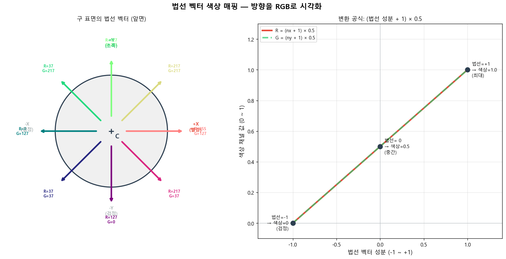

### 결과물

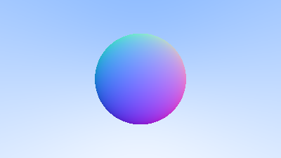

법선 방향이 색상으로 표현된 구. 이 법선 벡터가 이후 조명 계산(내적)의 핵심 입력이 된다.

### 관련 파일
- [src/main.cpp](pbr-raytracer/src/main.cpp)

---

## Ch.5 — 표면 법선과 다중 오브젝트 (Surface Normals and Multiple Objects)

### 왜 이걸 하는가?

Ch.4까지는 `main.cpp` 안에 `hit_sphere` 함수 하나로 구 하나만 다뤘다.
실제 씬은 **수많은 오브젝트**(구, 평면, 삼각형 메시…)로 구성된다.
이걸 깔끔히 다루려면 두 가지 변화가 필요하다:

1. **공통 인터페이스로 추상화** — 오브젝트마다 `hit_sphere`, `hit_plane`, `hit_triangle`을 따로 만들면 `ray_color`가 종류별 분기로 가득 찬다. 모두가 따르는 단일 인터페이스 `hittable` 을 만들면 `ray_color`는 종류를 신경 쓰지 않아도 된다.
2. **앞면/뒷면 법선 판별** — Ch.4의 법선 계산 `(P - C) / r` 은 **항상 바깥**을 향한다. 광선이 구 안에서 밖으로 나가는 경우 (유리 내부 굴절 등)에는 이 법선이 광선과 같은 방향이라 조명 계산이 깨진다. 이 챕터에서 광선이 표면을 어느 쪽에서 만났는지 구분하는 규칙을 도입한다.

이번 챕터에서 새로 등장하는 핵심 개념은 **앞면/뒷면 법선 판별**, 그리고 작은 유틸리티 클래스인 **`interval`** 이다.

---

### 추상화의 그림 — `hittable` 인터페이스

```
        ┌─────────────────┐
        │   hittable      │  ← 추상 클래스 (인터페이스)
        │   - hit(...)    │
        └────────┬────────┘
                 │ (상속)
        ┌────────┼────────┐
        ▼        ▼        ▼
     sphere  triangle  mesh   (구체적 구현체들)
```

광선이 어느 오브젝트에 맞았을 때 필요한 정보를 한 묶음으로:

```cpp
struct hit_record {
    point3 p;          // 충돌 지점
    vec3   normal;     // 법선 (광선의 반대쪽을 향하도록 정렬됨)
    double t;          // 광선 위의 거리
    bool   front_face; // 앞면을 맞았는가?
};
```

`hittable_list`는 여러 `hittable`을 담은 컨테이너다. 자기도 `hittable`을 상속해서, 자기 자신을 마치 하나의 거대한 오브젝트처럼 다룰 수 있다.

---

### 새로운 수학 개념: 앞면 vs 뒷면 법선 판별

#### ① 왜 이게 필요한가?

조명 계산에서 법선은 **항상 광선의 반대쪽**을 향해야 한다.
이유: `NdotL` (법선 · 광원 방향) 같은 내적은 "표면이 광원을 얼마나 정면으로 마주하는가"를 측정한다. 법선이 표면 안쪽을 향하면 부호가 뒤집혀 어두워야 할 곳이 밝아지는 식의 오류가 난다.

구 표면에서 단순히 $(P - C) / r$ 로 계산한 법선은 **항상 바깥**을 향한다.
- 광선이 밖에서 들어와서 부딪히면 → 광선과 법선이 **반대 방향** → OK ✓
- 광선이 안에서 나가다 부딪히면 → 광선과 법선이 **같은 방향** → 뒤집어야 함 ✗

#### ② 일상 비유

선풍기 앞에 손바닥을 펼친다고 상상하자. 손등이 선풍기를 향하면 바람이 손등을 때린다. 손바닥이 선풍기를 향해야 정면으로 바람을 맞는다.
**"법선(손바닥이 가리키는 방향)은 들어오는 바람(광선)의 반대 방향이어야 한다."** 이게 우리가 강제하고 싶은 규칙이다.

#### ③ 단계별 전개 — 내적 부호로 어떻게 판별하나?

광선 방향을 $\mathbf{d}$, 외향 법선(밖으로 향하는 법선)을 $\mathbf{n}_{out}$ 이라고 하자.

$$\mathbf{d} \cdot \mathbf{n}_{out} = |\mathbf{d}||\mathbf{n}_{out}|\cos\theta$$

길이는 양수이므로 부호는 $\cos\theta$ 가 결정한다.

| $\theta$ 범위 | $\cos\theta$ | 내적 부호 | 기하학적 의미 |
|---|---|---|---|
| 0° ~ 90° | 양수 | $\mathbf{d} \cdot \mathbf{n}_{out} > 0$ | 광선과 법선이 같은 쪽을 향함 → **광선이 안에서 나감** (뒷면) |
| 90° | 0 | 0 | 광선이 표면을 스침 |
| 90° ~ 180° | 음수 | $\mathbf{d} \cdot \mathbf{n}_{out} < 0$ | 광선과 법선이 반대쪽을 향함 → **광선이 밖에서 들어옴** (앞면) |

규칙:
- `dot(d, n_out) < 0` → **앞면 (front_face = true)**, 법선은 $\mathbf{n}_{out}$ 그대로
- `dot(d, n_out) > 0` → **뒷면 (front_face = false)**, 법선은 $-\mathbf{n}_{out}$ (뒤집기)

#### ④ 구체적 숫자 예시

광선이 오른쪽으로 직진: $\mathbf{d} = (1, 0, 0)$.

**경우 A — 광선이 구의 왼쪽 면에 부딪힘 (밖→안)**
충돌점은 구 중심 왼쪽이므로 외향 법선 $\mathbf{n}_{out} = (-1, 0, 0)$.

$$\mathbf{d} \cdot \mathbf{n}_{out} = 1 \times (-1) + 0 + 0 = -1$$

음수 → **앞면**. 법선 그대로 $(-1, 0, 0)$ 사용.

**경우 B — 광선이 구의 오른쪽 면에 부딪힘 (안→밖)**
충돌점은 구 중심 오른쪽이므로 외향 법선 $\mathbf{n}_{out} = (1, 0, 0)$.

$$\mathbf{d} \cdot \mathbf{n}_{out} = 1 \times 1 + 0 + 0 = +1$$

양수 → **뒷면**. 법선을 뒤집어 $(-1, 0, 0)$ 사용.

두 경우 모두 최종 법선은 광선($+x$ 방향)의 **반대 방향**($-x$)을 향한다 ✓.

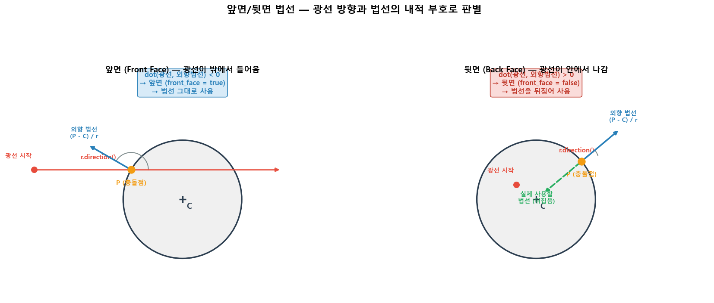

#### ⑤ 코드와 연결

```cpp
inline void set_face_normal(const ray& r, const vec3& outward_normal) {
    // outward_normal 은 항상 단위 벡터라고 가정 (호출자 책임)
    front_face = dot(r.direction(), outward_normal) < 0;
    normal     = front_face ? outward_normal : -outward_normal;
}
```

| 수식 | 코드 |
|------|------|
| $\mathbf{d}$ | `r.direction()` |
| $\mathbf{n}_{out}$ | `outward_normal` |
| $\mathbf{d} \cdot \mathbf{n}_{out} < 0$ | `dot(r.direction(), outward_normal) < 0` |
| 법선 뒤집기 | `front_face ? outward_normal : -outward_normal` |

> **설계 결정 — 누가 외향 법선을 만드나?**
> `set_face_normal` 호출자(즉 `sphere::hit`)가 외향 법선을 단위 벡터로 만들어 넘긴다.
> 이유: 오브젝트마다 외향 법선을 효율적으로 계산하는 방법이 다르다 (구는 `(P-C)/r`, 평면은 미리 저장된 상수).
> 인터페이스를 일반화하기보다 **각 오브젝트가 자기에게 최적인 방식으로 만들도록** 한다.

---

### 여러 오브젝트 중 가장 가까운 충돌 찾기

#### 왜 "가장 가까운" 것이 필요한가?

광선이 여러 오브젝트를 동시에 통과할 수 있다.
하지만 우리가 카메라로 보는 건 **가장 앞에 있는 표면**뿐이다 (뒤쪽은 가려져 안 보인다).

알고리즘의 핵심: **`closest`라는 임시 t 상한값을 들고 다니며**, 더 가까운 충돌을 발견할 때마다 갱신한다.

```cpp
double closest = t_max;
for (auto& obj : objects) {
    if (obj->hit(r, t_min, closest, temp_rec)) {
        closest = temp_rec.t;   // 다음 오브젝트는 이보다 가까운 충돌만 인정
        rec = temp_rec;
    }
}
```

이렇게 하면 단 한 번의 순회로 가장 가까운 충돌을 찾는다. 정렬 없이 O(n).

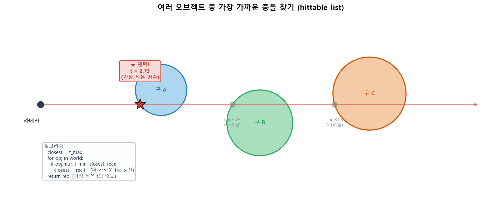

---

### `interval` 클래스 — t 범위를 한 변수로

지금까지 `t_min`과 `t_max`를 두 개의 매개변수로 다녔다. 이걸 하나의 객체로 묶으면:
- 매개변수 개수가 줄어 가독성 ↑
- `surrounds(x)`, `clamp(x)` 같은 범위 관련 유틸을 한 곳에 모을 수 있음

```cpp
class interval {
public:
    double min, max;
    interval(double mn, double mx) : min(mn), max(mx) {}
    bool surrounds(double x) const { return min < x && x < max; }
    bool contains(double x)  const { return min <= x && x <= max; }
};
```

`surrounds` 와 `contains` 의 차이는 경계 포함 여부다. 광선 충돌에서는 t가 정확히 t_min 일 때(자기 자신에게 충돌) 같은 케이스를 배제하기 위해 보통 `surrounds` 를 쓴다.

---

### 클래스 구성 — 누가 누구를 호출하나?

```
ray_color(r, world)
    └─ world.hit(r, [0, infinity], rec)        ← world 는 hittable_list
         ├─ sphere1.hit(r, [0, closest], temp) ← 가장 가까운 충돌 갱신
         ├─ sphere2.hit(r, [0, closest], temp)
         └─ ...
              └─ rec.set_face_normal(r, outward_normal)  ← 앞/뒷면 판별
```

---

### 결과물


씬에 큰 땅 구(반지름 100, 아래쪽) + 작은 구(반지름 0.5, 정면) 두 개를 배치했다.
두 구 모두 같은 `ray_color` 코드 한 줄 (`world.hit(...)`)로 처리된다.

- 작은 구: 표면 법선이 `(P-C)/r` 로 방향마다 다르므로 RGB 그라디언트로 보인다
- 땅 구: 카메라 시야에 들어오는 부분은 모두 위쪽 면(+Y 방향)이므로 초록(G채널)이 지배적이다
- `hittable` 추상화 덕분에 오브젝트가 100개여도 `ray_color` 코드는 그대로다

### 관련 파일
- [src/hittable.h](pbr-raytracer/src/hittable.h) (이번 챕터에서 추가)
- [src/sphere.h](pbr-raytracer/src/sphere.h) (이번 챕터에서 추가)
- [src/hittable_list.h](pbr-raytracer/src/hittable_list.h) (이번 챕터에서 추가)
- [src/interval.h](pbr-raytracer/src/interval.h) (이번 챕터에서 추가)
- [src/rtweekend.h](pbr-raytracer/src/rtweekend.h) (이번 챕터에서 추가)
- [src/main.cpp](pbr-raytracer/src/main.cpp) (리팩토링)

---

## Ch.6 — 안티에일리어싱 (Antialiasing)

### 왜 이걸 하는가?

Ch.5의 결과 이미지를 자세히 보면 구의 가장자리가 **계단처럼 톱니** 모양이다.
원인: 한 픽셀당 광선을 **딱 한 개**, 그것도 **픽셀 정중앙**으로만 쐈기 때문이다.

이게 왜 문제인가? 한 픽셀의 영역 안에 구가 30%만 차 있다고 하자. 픽셀 중심에서 쏜 광선 하나가 구를 맞히면 그 픽셀은 **100% 구 색**, 빗맞으면 **100% 배경 색**이다. 중간이 없다. 결과적으로 가장자리가 0/100으로 뚝 끊긴다.

이번 챕터의 목표: 픽셀 안의 **여러 위치**에 광선을 쏘고 색의 **평균**을 내자. 그러면 30%가 구를 맞히면 자연스럽게 30% 구색 + 70% 배경색이 섞여 부드러운 가장자리가 된다.

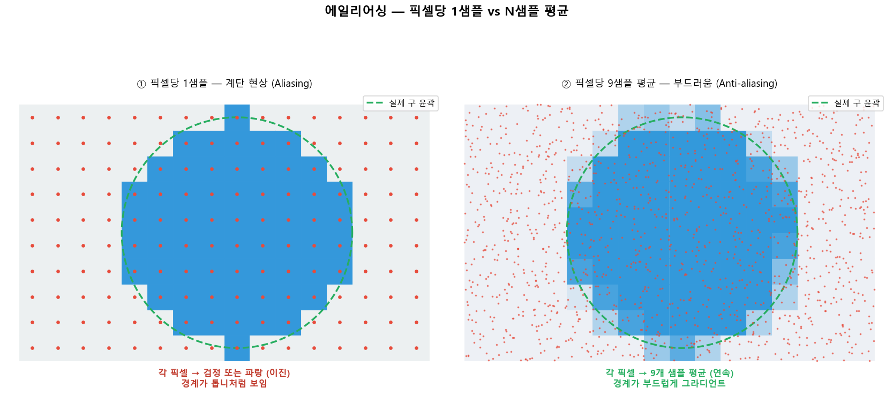

---

### 새로운 수학 개념: 픽셀 내 무작위 샘플링과 평균

#### ① 왜 이게 필요한가?

위의 그림처럼 픽셀 중심 1개로는 "그 픽셀 영역 안의 색"을 잘 대표하지 못한다. 픽셀은 점이 아니라 **작은 사각형 영역**이고, 그 영역에 들어오는 빛의 평균이 그 픽셀의 진짜 색이다.

수식으로 쓰면 픽셀의 진짜 색은 적분이다 ($C(x,y)$는 코드의 `ray_color(x, y)`):

$$\text{픽셀 색} = \frac{1}{\text{픽셀 면적}} \iint_{\text{픽셀}} C(x, y) \, dx \, dy$$

이걸 정확히 계산할 수는 없으므로, 무작위 샘플로 **근사**한다 (몬테카를로 추정):

$$\text{픽셀 색} \approx \frac{1}{N} \sum_{k=1}^{N} C(x_k, y_k)$$

#### ② 일상 비유

흐릿한 사진을 찍는 두 가지 방식을 떠올려보자:
- **방법 A**: 셔터를 1/1000초로 한 번 찍고 결과를 저장 → 그 순간만 포착
- **방법 B**: 셔터를 1/1000초로 100번 찍고 평균 → 흔들림과 노이즈가 줄고 부드러움

레이트레이싱의 안티에일리어싱이 정확히 방법 B다. 픽셀 안의 다양한 위치에서 빛을 여러 번 "찍고" 평균을 낸다.

#### ③ 단계별 전개 — 픽셀 안 무작위 위치는 어떻게 만드나?

지금까지 픽셀 (i, j)의 중심 위치는 ($P_{00}$ = `pixel00_loc`, $\Delta u$ = `pixel_delta_u`, $\Delta v$ = `pixel_delta_v`):

$$P_{ij} = P_{00} + i \cdot \Delta u + j \cdot \Delta v$$

여기서 $i$, $j$ 는 정수다. 픽셀 안의 임의 위치를 가지려면 정수 대신 **연속된 실수**로 만들면 된다:

$$S_{ij} = P_{00} + (i + dx) \cdot \Delta u + (j + dy) \cdot \Delta v$$

여기서 $dx, dy$ 는 $[0, 1)$ 범위의 무작위 실수.
- $dx = 0, dy = 0$ → 픽셀의 왼쪽 위 모서리
- $dx = 0.5, dy = 0.5$ → 픽셀 중심 (Ch.5의 방식)
- $dx = 0.99, dy = 0.99$ → 픽셀의 오른쪽 아래 모서리 근처

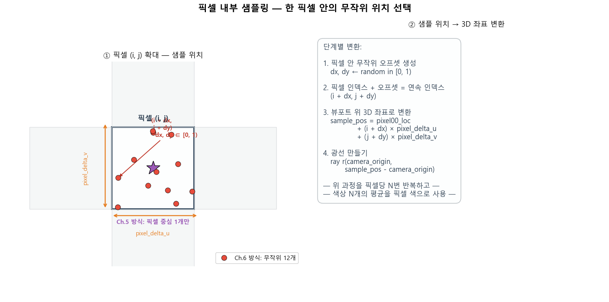

#### ④ 구체적 숫자 예시

이미지 너비 400, 뷰포트 너비 3.55라 가정 → `pixel_delta_u = 3.55 / 400 = 0.008875`.

픽셀 (i=100, j=50) 안에 샘플 3개를 만들어보자:

| 샘플 | dx | dy | i + dx | j + dy | 픽셀 안 어느 위치인가? |
|------|-----|-----|--------|--------|--------------------|
| 1 | 0.231 | 0.812 | 100.231 | 50.812 | 왼쪽 위쪽 |
| 2 | 0.674 | 0.105 | 100.674 | 50.105 | 오른쪽 아래쪽 |
| 3 | 0.418 | 0.526 | 100.418 | 50.526 | 거의 중앙 |

이 3개 위치 각각에서 광선을 쏘고 ray_color를 받는다. 그 색 3개를 더해서 3으로 나눈 값이 픽셀 (100, 50)의 최종 색.

#### ⑤ 코드와 연결

샘플 1개를 만들어 광선을 반환하는 함수 (camera 클래스 안에 들어갈 메서드):

```cpp
ray get_ray(int i, int j) const {
    vec3 offset = sample_square();                          // (dx-0.5, dy-0.5, 0)
    point3 pixel_sample = pixel00_loc
                        + ((i + offset.x()) * pixel_delta_u)
                        + ((j + offset.y()) * pixel_delta_v);
    return ray(center, pixel_sample - center);
}

vec3 sample_square() const {
    // [-0.5, +0.5) 범위 사각형 안의 무작위 점 (z=0)
    return vec3(random_double() - 0.5, random_double() - 0.5, 0);
}
```

> 실제 구현에서는 `[0, 1)` 대신 `[-0.5, +0.5)` 를 쓴다. 이러면 `(i, j)` 가 픽셀 **중심** 좌표가 되고 샘플은 그 주변에 균등 분포한다. 의미는 동일.

| 수식 | 코드 |
|------|------|
| $dx, dy$ | `random_double()` 결과 |
| $(i + dx, j + dy)$ | `(i + offset.x(), j + offset.y())` |
| $S_{ij}$ | `pixel_sample` |
| $\frac{1}{N}\sum$ | 색을 누적해 `samples_per_pixel`로 나눔 |

---

### `random_double()` — 0~1 무작위 실수

C++ 표준 라이브러리 사용. 단순하게 시작:

```cpp
inline double random_double() {
    // [0, 1) 범위의 균등분포 실수
    return std::rand() / (RAND_MAX + 1.0);
}
```

> `RAND_MAX + 1.0` 으로 나누는 이유: `std::rand()` 는 [0, RAND_MAX] 정수를 돌려준다. 그대로 RAND_MAX로 나누면 결과 범위가 `[0, 1]` (1 포함) 이라 가끔 1.0이 나온다. `+1.0`으로 분모를 키우면 결과가 `[0, 1)` 이 되어 1을 절대 포함하지 않는다.

나중에 더 좋은 PRNG가 필요해지면 `std::mt19937` (Mersenne Twister)로 교체하면 된다 — 인터페이스(함수 시그니처)만 같으면 호출하는 쪽 코드는 한 줄도 안 바뀐다.

---

### `camera` 클래스로 분리 — 이번 챕터의 진짜 핵심

지금까지 main.cpp 안에 카메라 설정, 뷰포트 계산, 픽셀 순회 루프, 광선 발사가 모두 흩어져 있었다. 이걸 모두 `camera` 클래스 하나로 묶는다.

```
[Ch.5 main.cpp 구조]            [Ch.6 main.cpp 구조]
- 이미지 크기 설정              - 씬 만들기
- 뷰포트 계산                   - 카메라 설정 (3~4줄)
- 픽셀 순회 루프      ────→     - camera.render(world)
- 광선 발사                       끝.
- 색상 출력
```

**왜 이게 중요한가?**
- main.cpp는 **"무엇을 그릴지"**(씬)만 신경 쓴다. **"어떻게 그릴지"**(픽셀 순회/샘플링/광선 발사)는 camera가 모두 처리.
- 다음 챕터들에서 카메라 기능이 추가될 때(이동 가능한 카메라, defocus blur 등) main.cpp는 거의 변하지 않는다.
- 한 씬을 다른 카메라 설정으로 여러 번 렌더하기 쉬워진다.

`camera` 클래스가 책임지는 일:
1. **public 입력**: `aspect_ratio`, `image_width`, `samples_per_pixel`
2. **`render(const hittable& world)`**: 모든 픽셀을 순회하며 PPM 출력
3. **`initialize()`** (private): 뷰포트, 픽셀 델타 등 내부 값 계산
4. **`get_ray(i, j)`** (private): 픽셀 (i, j) 안의 무작위 샘플로 광선 1개 생성
5. **`ray_color(r, world)`** (private): 광선의 색 결정 (Ch.5에서 가져옴)

---

### 결과물

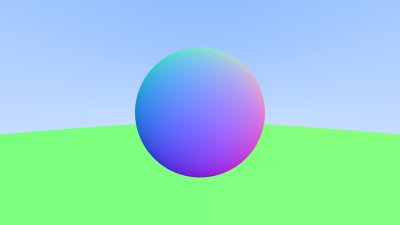

`samples_per_pixel = 100` 으로 설정. Ch.5의 결과와 같은 씬이지만 **구의 가장자리가 톱니 없이 부드럽다.**
픽셀 하나당 무작위 위치 100개에서 광선을 쏘고 색의 평균을 냈기 때문이다.

대신 렌더 시간은 Ch.5의 ~100배 (광선이 100배 많아짐). Debug 빌드면 1~3분, Release 빌드면 수십 초.

또 한 가지 큰 변화 — `main.cpp`가 30줄로 줄어들었다. 카메라/뷰포트/픽셀 순회/샘플링/광선 발사가 모두 `camera` 클래스 안에 캡슐화됐다.

### 관련 파일
- [src/camera.h](pbr-raytracer/src/camera.h) (이번 챕터에서 추가, 메인 작업)
- [src/color.h](pbr-raytracer/src/color.h) (이번 챕터에서 추가, `write_color()` + 클램핑)
- [src/interval.h](pbr-raytracer/src/interval.h) (`clamp()` 추가)
- [src/rtweekend.h](pbr-raytracer/src/rtweekend.h) (`random_double()` 추가)
- [src/main.cpp](pbr-raytracer/src/main.cpp) (대폭 단순화)

---

## Ch.7 — 확산 재질 (Diffuse Materials)

### 왜 이걸 하는가?

Ch.6까지의 결과는 구가 법선 방향을 색으로 표현한 것이었다. **실제 빛이 없었다.**
조명 없는 렌더링은 포토샵의 "3D 와이어프레임"처럼 기술적인 시각화일 뿐이다.

이번 챕터의 목표: 구가 **물리적으로 빛을 받고 반사하는** 것처럼 보이게 한다.
결과물: 회색 매트 재질의 구, 자연스러운 그림자, 구끼리 서로 빛을 주고받는 간접광.

이를 위해 세 가지 개념을 도입한다:
1. **Diffuse 반사** — 빛이 표면에서 모든 방향으로 흩어짐
2. **재귀 광선 추적** — 반사된 광선도 또다시 씬을 추적
3. **감마 보정** — 저장된 색이 모니터에서 자연스럽게 보이도록 보정

---

### 개념 1: Diffuse란 무엇인가

**머릿속 그림:**
손전등으로 거울을 비추면 빛이 한 방향으로 날카롭게 반사된다.
같은 손전등으로 하얀 종이를 비추면 빛이 **사방으로 흩어진다.**
Diffuse(난반사)는 종이처럼 반사하는 방식이다.

**비유:**
당구공을 시멘트 바닥에 치면 예측 가능한 방향으로 튄다 (거울 반사).
마른 모래 위에서 치면 어디로 튈지 모른다 (Diffuse).

**PBR에서의 위치:**
흙, 나무, 종이, 피부, 천 — 우리 주변 대부분의 재질이 Diffuse다.
금속, 물, 유리처럼 "반짝이는" 재질만이 Diffuse가 아니다.

---

### 개념 2: 무작위 반사 방향 — 수학

#### ① 왜 이게 필요한가?

광선이 구 표면의 점 $\mathbf{P}$에 맞았다. 이 점에서 새 광선을 어느 방향으로 쏠지 결정해야 한다.
Diffuse 재질은 방향이 **무작위**다. 다만 아무 방향이나 아니고, **표면 바깥쪽 반구** 안에서만 무작위다.
(표면 안쪽으로 반사하면 물체를 뚫고 나가는 것이니 물리적으로 말이 안 된다.)

#### ② 머릿속 그림

```
               S (단위구 표면 위의 무작위 점)
              ↗
         P + N  (법선 끝 = 단위구의 중심)
         ↑
         N (법선, 길이 1)
         |
─────────P──────── (구 표면)
```

**전략:**
- 충돌점 $\mathbf{P}$에서 법선 $\mathbf{N}$ 방향으로 1만큼 이동하면 → 점 $\mathbf{P} + \mathbf{N}$
- 이 점을 중심으로 하는 **단위구**(반지름 1) 위의 무작위 점 $\mathbf{S}$를 고른다
- 새 광선 방향 = $\mathbf{S} - \mathbf{P}$

이 방식은 자연스럽게 **법선과 가까운 방향을 더 자주 선택**한다 (람베르트 분포, 아래 설명).

#### ③ 단위구 안의 무작위 점 — 기각 샘플링

단위구 표면 위에서 직접 무작위 점을 고르는 공식은 복잡하다.
대신 더 쉬운 방법을 쓴다:

```
1단계: [-1, 1]³ 정육면체 안의 무작위 점 p를 뽑는다
2단계: p가 단위구 안에 있는가? (|p|² < 1 인가?)
       YES → 반환
       NO  → 버리고 1단계로 돌아가 다시 뽑는다
```

이것이 **기각 샘플링(rejection sampling)**이다.

왜 이게 동작하는가?

| 도형 | 부피 공식 | 수치 (반지름/한 변 = 1) |
|------|---------|----------------------|
| 정육면체 (한 변 2) | $2^3 = 8$ | 8 |
| 단위구 (반지름 1) | $\frac{4}{3}\pi r^3$ | 약 4.19 |
| 구/정육면체 비율 | | 약 52% |

뽑은 점이 구 안에 있을 확률이 52%이므로, 평균 약 2번이면 성공한다.

**숫자 예시:**

임의의 점 $\mathbf{p} = (0.3, -0.8, 0.4)$ 가 단위구 안에 있는가?

$$|\mathbf{p}|^2 = 0.3^2 + (-0.8)^2 + 0.4^2 = 0.09 + 0.64 + 0.16 = 0.89$$

$0.89 < 1$ 이므로 → 구 **안에** 있다. ✓ 사용 가능.

임의의 점 $\mathbf{q} = (0.7, 0.6, 0.6)$ 이라면?

$$|\mathbf{q}|^2 = 0.49 + 0.36 + 0.36 = 1.21$$

$1.21 > 1$ 이므로 → 구 **밖에** 있다. ✗ 버리고 다시 뽑기.

#### ④ 단위구 표면 위의 점으로 정규화

구 **안**의 점을 구했으면, 그것을 정규화(길이를 1로 맞추기)해서 구 **표면** 위의 점으로 변환한다.

$$\hat{v} = \frac{\mathbf{v}}{|\mathbf{v}|}$$

왜 표면 위여야 하는가? → 방향이 필요할 뿐 길이는 필요 없다. 길이를 1로 고정해두면 이후 계산이 단순해진다.

#### ⑤ 코드와 연결

| 수식 기호 | 코드 | 의미 |
|---------|------|------|
| $\mathbf{p}$ (정육면체 안 점) | `vec3::random(-1, 1)` | 각 성분이 [-1, 1) 인 무작위 벡터 |
| $\|\mathbf{p}\|^2 < 1$ | `p.length_squared() < 1` | 단위구 안인지 확인 |
| 구 안의 점 반환 | `random_in_unit_sphere()` | |
| 정규화 | `unit_vector(...)` | 길이를 1로 맞춤 |
| 구 표면 위 무작위 점 | `random_unit_vector()` | |
| 법선과 같은 반구 보장 | `random_on_hemisphere(normal)` | dot < 0 이면 뒤집기 |

```cpp
// 기각 샘플링: 단위구 안의 점
inline vec3 random_in_unit_sphere() {
    while (true) {
        vec3 p = vec3::random(-1, 1);
        if (p.length_squared() < 1)  // |p|² < 1 → 구 안에 있음
            return p;
    }
}

// 정규화해서 구 표면 위의 점으로
inline vec3 random_unit_vector() {
    return unit_vector(random_in_unit_sphere());
}

// 법선과 같은 반구 쪽인지 확인
inline vec3 random_on_hemisphere(const vec3& normal) {
    vec3 on_unit_sphere = random_unit_vector();
    if (dot(on_unit_sphere, normal) > 0.0)  // 내적 > 0 → 같은 방향
        return on_unit_sphere;
    else
        return -on_unit_sphere;  // 반대쪽이면 뒤집기
}
```

---

### 개념 3: 재귀 광선 추적 (Recursive Ray Tracing)

#### ① 왜 이게 필요한가?

새 광선을 쏘면, 그 광선도 또 다른 물체에 맞을 수 있다.
그 물체에서도 또 반사... 이 과정이 반복되면서 **간접광**이 자연스럽게 생긴다.

예: 구 A에서 반사된 광선이 구 B에 맞고, 구 B에서 반사된 광선이 하늘에 닿는다.
결과: 구 A에 구 B의 색이 미세하게 물들고, 그림자도 완전한 검정이 아니라 주변 색을 반사한다.

**머릿속 그림:**

```
카메라 → 광선 → 구 A 표면에 맞음
                    ↓ 반사 (0.5배 감쇠)
              새 광선 → 구 B 표면에 맞음
                            ↓ 반사 (0.5배 감쇠)
                      새 광선 → 하늘 (하늘 색 반환)
                      ← 하늘 색 반환
                  ← 하늘 색 × 0.5 반환
← 하늘 색 × 0.5 × 0.5 반환
```

#### ② 감쇠 — 0.5를 곱하는 이유

Diffuse 재질은 들어오는 빛의 일부를 흡수한다.
우리 구는 50%를 흡수하고 50%를 반사한다고 설정한다 → `0.5 * ray_color(...)`.

반사가 3번 일어나면: $0.5^3 = 0.125$ → 원래 밝기의 12.5%만 남는다.
무한히 반사하면 결국 0에 수렴한다. 수학적으로 안전하다.

#### ③ max_depth — 무한 재귀를 막는 방법

이론상 광선이 두 거울 사이에서 영원히 반사될 수 있다.
`max_depth`는 광선이 최대 몇 번 반사될 수 있는지 제한한다.

```
depth = 50 으로 시작
  → 반사 1번: depth = 49
  → 반사 2번: depth = 48
  → ...
  → depth = 0 이 되면 검정(0, 0, 0) 반환 → 더 이상 추적하지 않음
```

**숫자 예시 — 밝기가 어떻게 감쇠하는가:**

하늘 색이 흰색 (1.0, 1.0, 1.0) 이라 가정:

| 반사 횟수 | 밝기 | 계산 |
|---------|------|------|
| 0 (하늘 직접) | 1.0 | $1.0$ |
| 1번 반사 후 | 0.5 | $1.0 \times 0.5$ |
| 2번 반사 후 | 0.25 | $1.0 \times 0.5^2$ |
| 5번 반사 후 | 0.031 | $1.0 \times 0.5^5$ |
| 10번 반사 후 | 0.001 | $1.0 \times 0.5^{10}$ |

10번만 지나도 사실상 검정이다. `max_depth = 50`은 충분히 넉넉하다.

#### ④ 코드와 연결

```cpp
color ray_color(const ray& r, int depth, const hittable& world) const {
    if (depth <= 0)
        return color(0, 0, 0);  // 최대 깊이 초과 → 검정

    hit_record rec;
    // t_min = 0.001: shadow acne 방지 (아래 별도 설명)
    if (world.hit(r, interval(0.001, infinity), rec)) {
        vec3 direction = random_on_hemisphere(rec.normal);  // 무작위 반사 방향
        return 0.5 * ray_color(ray(rec.p, direction), depth - 1, world);
        //     ↑ 50% 흡수   ↑ 재귀 호출, depth 1 감소
    }
    // 하늘 그라디언트 (기존과 동일)
    ...
}
```

| 수식 / 개념 | 코드 |
|-----------|------|
| 최대 반사 횟수 | `max_depth` (public 설정값) |
| 재귀 깊이 | `depth` 매개변수 |
| 50% 감쇠 | `0.5 *` |
| 재귀 호출 | `ray_color(ray(rec.p, direction), depth - 1, world)` |

---

### 개념 4: Shadow Acne — 부동소수점 오차와 그 해결

#### ① 무엇이 문제인가

**머릿속 그림:**

```
광선이 구 표면 점 P에 맞았다.
P에서 새 광선을 쏜다.
              ↓
부동소수점 계산 오차로
P가 구 표면보다 아주 살짝 (0.000001) 아래에 있다.
              ↓
새 광선이 t ≈ 0.000001 에서
자기 자신 구 표면과 다시 교차!
              ↓
결과: 광선이 구에서 반사되자마자 다시 구에 막혀 검정이 됨
      표면 전체에 무작위 검은 점이 찍힘 → "Shadow Acne"
```

#### ② 해결책 — t 범위의 하한을 0이 아닌 0.001로 설정

```cpp
// 이전 (문제 있음)
world.hit(r, interval(0.0, infinity), rec)

// 이후 (해결)
world.hit(r, interval(0.001, infinity), rec)
```

t = 0.001 미만인 교차는 무시한다. 부동소수점 오차로 생기는 자기 교차는 t가 거의 0에 가까우므로 모두 걸러진다.

0.001은 경험적인 값이다. 너무 크면 가까운 물체의 그림자가 잘리고, 너무 작으면 acne가 남는다.

---

### 개념 5: 감마 보정 (Gamma Correction)

#### ① 왜 이게 필요한가?

**머릿속 그림:**
우리 코드는 색을 선형 값(0.0~1.0)으로 계산한다.
예: "이 픽셀은 최대 밝기의 25%" → 0.25

모니터는 이 숫자를 선형으로 해석하지 않는다.
모니터의 밝기 = (저장값)^2.2 (감마 2.2)

결과: 저장값 0.25 → 실제 밝기 $0.25^{2.2} \approx 0.048$ (원래의 19%밖에 안 됨)
어두운 색이 실제보다 **훨씬 더 어둡게** 보인다.

#### ② 해결책 — 저장 전에 역보정

모니터가 $x^{2.2}$를 적용할 것을 알고 있으므로, 저장 전에 $x^{1/2.2}$를 미리 적용한다.
모니터가 다시 2.2제곱하면 원래 선형 값이 복원된다.

정확한 보정은 $x^{1/2.2}$이지만, 우리는 근사값으로 **$\sqrt{x}$ (= $x^{0.5}$)** 를 쓴다 (감마 2 보정).

**숫자 예시 — 저장값과 모니터 표시 밝기 비교:**

| 선형 색값 | 감마 보정 없이 저장 | 보정 후 저장 ($\sqrt{x}$) | 모니터 표시 ($^{2.2}$ 적용) |
|---------|----------------|------------------------|--------------------------|
| 0.04 (4%) | 0.04 → 아주 어두움 | $\sqrt{0.04} = 0.2$ | $0.2^{2.2} \approx 0.033$ ≈ 3% |
| 0.25 (25%) | 0.25 → 너무 어두움 | $\sqrt{0.25} = 0.5$ | $0.5^{2.2} \approx 0.218$ ≈ 22% |
| 1.0 (100%) | 1.0 → 정상 | $\sqrt{1.0} = 1.0$ | $1.0^{2.2} = 1.0$ ✓ |

보정 후 저장값이 모니터를 거쳐도 선형 값에 가까워진다.

#### ③ 시각적 효과

감마 보정 전: 구 전체가 칙칙하고 어두움. 특히 그림자 부분이 거의 검정.
감마 보정 후: 어두운 영역이 밝아지고, 전체적으로 자연스러운 밝기.

#### ④ 코드와 연결

```cpp
inline double linear_to_gamma(double linear_component) {
    if (linear_component > 0)
        return std::sqrt(linear_component);  // sqrt = 감마 2 보정
    return 0;
}

inline void write_color(std::ostream& out, const color& pixel_color) {
    double r = linear_to_gamma(pixel_color.x());  // 저장 직전에 보정
    double g = linear_to_gamma(pixel_color.y());
    double b = linear_to_gamma(pixel_color.z());
    ...
}
```

| 수식 | 코드 |
|------|------|
| 선형 색값 | `pixel_color.x()` 등 |
| $\sqrt{x}$ (감마 보정) | `std::sqrt(linear_component)` |
| 보정된 값 | `r`, `g`, `b` |

---

### 결과물

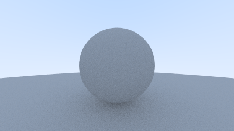

Ch.6(법선 색)과 비교:

| 항목 | Ch.6 | Ch.7 |
|------|------|------|
| 구 색상 | 방향별 RGB 법선 색 | 회색 매트 재질 |
| 그림자 | 없음 | 자연스러운 그림자 |
| 간접광 | 없음 | 구끼리 빛을 주고받음 |
| 감마 보정 | 없음 | sqrt로 자연스러운 밝기 |

### 관련 파일
- [src/vec3.h](pbr-raytracer/src/vec3.h) (`random()`, `random_in_unit_sphere()`, `random_unit_vector()`, `random_on_hemisphere()` 추가)
- [src/camera.h](pbr-raytracer/src/camera.h) (`max_depth` 추가, `ray_color` 재귀화)
- [src/color.h](pbr-raytracer/src/color.h) (`linear_to_gamma()` 추가, `write_color` 갱신)

---

## Ch.8 — 금속 재질 (Metal)

### 왜 이걸 하는가?

Ch.7까지는 모든 표면이 빛을 무작위 방향으로 흩뿌리는 확산 재질(Diffuse)뿐이었다.
현실의 재질은 훨씬 다양하다 — 금속은 빛을 **정해진 방향으로 반사**하고, 유리는 빛을 통과시킨다.

이번 챕터의 목표:
1. **`material` 추상화** — 재질 종류를 코드 구조로 정리 (OOP 설계)
2. **`lambertian`** — Ch.7의 확산 반사를 재질 클래스로 분리
3. **`metal`** — 정반사(reflection) + `fuzz`(흐림) 구현

결과: 씬 안에서 확산 구와 금속 구가 **각자 다르게 빛을 반사**한다.

---

### 개념 1: `material` 추상화 — 왜 클래스 계층이 필요한가?

Ch.7의 `ray_color()`는 광선이 물체에 맞으면 항상 "람베르트 확산"을 했다.
하드코딩이라 다른 재질을 추가하려면 `if/else` 분기가 끝없이 늘어난다.

**설계 결정:**
`material` 추상 클래스 하나를 만들고, 모든 재질이 `scatter()` 하나만 구현하도록 한다.

```
        ┌──────────────────────┐
        │    material          │  ← 인터페이스 (추상 클래스)
        │    + scatter(...)    │    "이 광선이 어디로 튀는가?"
        └──────────┬───────────┘
                   │ (상속)
          ┌────────┼────────┐
          ▼        ▼        ▼
     lambertian   metal   dielectric  (재질별 구현)
```

`scatter()`의 계약:
- 입력: 입사 광선 `r_in`, 충돌 정보 `rec`
- 출력: 산란 광선 `scattered`, 감쇠 색 `attenuation`
- 반환값: `true` = 빛이 반사됨, `false` = 빛이 완전 흡수됨

`camera.h`의 `ray_color()`는 이제 재질 종류를 전혀 몰라도 된다:

```cpp
if (rec.mat->scatter(r, rec, attenuation, scattered))
    return attenuation * ray_color(scattered, depth - 1, world);
return color(0, 0, 0);  // 흡수됨
```

**`hittable.h`와 `material.h`의 순환 참조 문제:**
`hit_record`는 `shared_ptr<material>`을 들고 있고,
`material`의 `scatter()`는 `hit_record`를 매개변수로 받는다.
A가 B를 include하고 B가 A를 include하면 무한 순환이다.

해결책: **전방 선언(forward declaration)**
```cpp
// hittable.h 맨 위
class material;  // "material이라는 클래스가 존재함"만 선언. 내용은 몰라도 포인터는 만들 수 있다.
```

---

### 개념 2: 정반사(Reflection) — 금속 재질의 핵심 수학

#### ① 왜 이게 필요한가?

Diffuse는 광선이 어디서 왔든 무관하게 무작위 방향으로 튄다.
금속은 다르다 — **입사 방향을 법선에 대해 대칭으로 뒤집은 딱 한 방향**으로만 반사된다.
이 수식 없이는 금속 표면에서 광선이 어디로 가야 할지 계산할 수 없다.

#### ② 머릿속 그림

```
      입사 광선 v          반사 광선 v_ref
             ↘            ↗
              \          /
───────────────P──────────────── 표면
               ↑
               n (법선)
```

법선을 기준으로 좌우가 완전히 대칭. 입사각 = 반사각.

#### ③ 일상 비유

당구공이 쿠션에 부딪힐 때, 쿠션(표면)과 **나란한 성분은 그대로**, 쿠션에 **수직인 성분(법선 방향)만 뒤집힌다.**

#### ④ 수식 전개 — 빈 단계 없이

벡터 $\mathbf{v}$ (입사 방향), $\hat{n}$ (표면 법선, 단위벡터).

**1단계 — v를 두 성분으로 분해:**

$$\mathbf{v} = \underbrace{(\mathbf{v} \cdot \hat{n})\hat{n}}_{\text{법선 방향 성분}} + \underbrace{\mathbf{v} - (\mathbf{v} \cdot \hat{n})\hat{n}}_{\text{법선 수직 성분}}$$

**2단계 — 반사 = 법선 수직 성분은 유지, 법선 방향 성분만 부호 반전:**

$$\mathbf{v}_{ref} = \underbrace{\mathbf{v} - (\mathbf{v} \cdot \hat{n})\hat{n}}_{\text{수직 성분 그대로}} + \underbrace{(-(\mathbf{v} \cdot \hat{n})\hat{n})}_{\text{법선 성분 뒤집기}}$$

**3단계 — 정리:**

$$\boxed{\mathbf{v}_{ref} = \mathbf{v} - 2(\mathbf{v} \cdot \hat{n})\hat{n}}$$

#### ⑤ 수식의 의미

$\mathbf{v} - 2(\mathbf{v} \cdot \hat{n})\hat{n}$ 는 "입사 방향에서 법선 방향 성분을 두 배 뺀다"는 뜻이다.
법선 방향만 부호가 바뀌고 나머지는 그대로이므로 **입사각 = 반사각**이 자동으로 성립한다.

#### ⑥ 구체적 숫자 예시

$\mathbf{v} = (1, -1, 0)$ (45도 아래 오른쪽), $\hat{n} = (0, 1, 0)$ (위를 향하는 법선)

$$\mathbf{v} \cdot \hat{n} = (1)(0) + (-1)(1) + (0)(0) = -1$$

$$\mathbf{v}_{ref} = (1, -1, 0) - 2 \times (-1) \times (0, 1, 0) = (1, -1, 0) + (0, 2, 0) = (1, 1, 0)$$

$(1, -1, 0)$이 $(1, 1, 0)$으로 — y 성분만 뒤집혔다 ✓ 완벽한 대칭 반사.

#### ⑦ 코드와 연결

| 수식 기호 | 코드 | 의미 |
|---------|------|------|
| $\mathbf{v}$ | `v` | 입사 광선 방향 |
| $\hat{n}$ | `n` | 표면 법선 (단위벡터) |
| $\mathbf{v} \cdot \hat{n}$ | `dot(v, n)` | 내적 |
| $2(\mathbf{v} \cdot \hat{n})\hat{n}$ | `2*dot(v,n)*n` | 법선 방향 성분 × 2 |
| $\mathbf{v}_{ref}$ | `v - 2*dot(v,n)*n` | 반사 벡터 |

```cpp
// vec3.h
inline vec3 reflect(const vec3& v, const vec3& n)
{
    return v - 2*dot(v,n)*n;
}
```

---

### 개념 3: Fuzz — 흐린 금속 반사

완벽한 거울만 있으면 재미없다. 실제 금속은 표면이 약간 거칠어서 반사가 흐릿하다.

**아이디어:** 반사된 방향에 **작은 무작위 벡터를 더한다.**

```
완벽한 반사: reflected
                 ↗
────────────────── 표면

fuzz = 0.3:  reflected + 0.3 * random_unit_vector()
            /↗   ↗  ↗  (여러 방향 중 하나)
────────────────── 표면
```

- `fuzz = 0` → 완벽한 거울
- `fuzz = 1` → 매우 흐린 금속
- `fuzz > 1` → 의미 없음, 코드에서 1로 클램프

반사된 방향을 정규화한 뒤 fuzz를 더하는 이유:
벡터 크기가 크면 fuzz의 영향이 줄어들고, 크기가 작으면 fuzz의 영향이 커진다.
정규화(길이 = 1)해야 fuzz가 항상 일관된 크기로 작용한다.

```cpp
reflected = unit_vector(reflected) + (fuzz * random_unit_vector());
```

**fuzz가 너무 크면 생기는 문제:**
무작위 벡터가 반사 방향을 표면 안쪽으로 밀어 넣을 수 있다.
이 경우 `dot(scattered.direction(), rec.normal) > 0` 검사로 빛 흡수 처리:

```cpp
return dot(scattered.direction(), rec.normal) > 0;
```

---

### 결과물

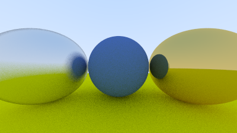

| 구 | 재질 | fuzz | 특징 |
|----|------|------|------|
| 가운데 (파랑) | `lambertian(0.1, 0.2, 0.5)` | — | 빛이 모든 방향으로 흩어짐 |
| 왼쪽 (은색) | `metal(0.8, 0.8, 0.8)` | 0.3 | 흐린 반사, 주변이 뭉개짐 |
| 오른쪽 (금색) | `metal(0.8, 0.6, 0.2)` | 0.0 | 완벽한 거울, 씬이 선명히 반사 |

오른쪽 금속 구에 왼쪽 금속 구의 모습이 선명하게 비치고, 노란 땅이 두 금속 구 표면에 반사되어 섞인다.
`fuzz` 차이가 시각적으로 명확하게 드러난다.

### 관련 파일
- [src/vec3.h](pbr-raytracer/src/vec3.h) (`near_zero()`, `reflect()` 추가)
- [src/material.h](pbr-raytracer/src/material.h) (이번 챕터에서 추가 — `material`, `lambertian`, `metal`)
- [src/hittable.h](pbr-raytracer/src/hittable.h) (`hit_record`에 `shared_ptr<material> mat` 추가)
- [src/sphere.h](pbr-raytracer/src/sphere.h) (생성자에 `material` 인자 추가, `rec.mat` 저장)
- [src/camera.h](pbr-raytracer/src/camera.h) (`ray_color`에서 `mat->scatter()` 호출로 교체)
